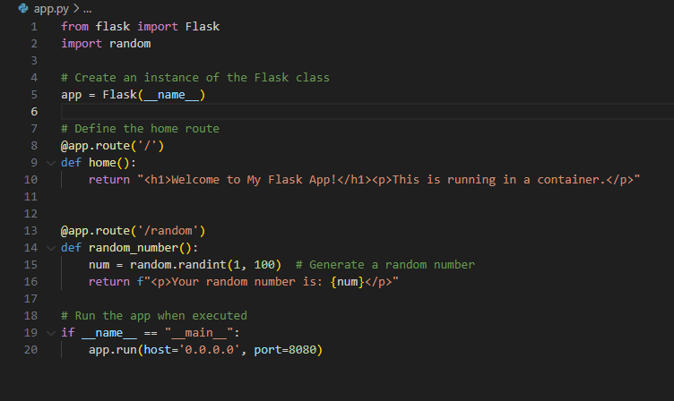

# HHA504_assignment_containers

# Project Documentation: Deploying and Managing Containers with Azure Container Apps

## 1. Introduction

The objective of this project is to acquire practical experience in deploying and managing containerized applications using cloud services such as **Google Cloud Platform (GCP) Cloud Run** and **Azure Container Apps**. This project involved the containerization of a Python Flask application using Docker, followed by its deployment on a cloud platform.

For this assignment, I opted to deploy the application on **Azure Container Apps** rather than GCP Cloud Run. This document outlines the steps undertaken to complete the project, focusing on Azure as the chosen deployment platform.

## 2. Dockerization of the Flask Application

To containerize the Flask application, I followed the steps outlined below:

### Dockerfile

The following **Dockerfile** was created to containerize the Python Flask application:

    dockerfile
    # Use an official Python runtime as a parent image
    FROM python:3.8-slim
    
    # Set the working directory in the container
    WORKDIR /app
    
    # Copy the current directory contents into the container at /app
    COPY . /app
    
    # Install any needed packages specified in requirements.txt
    RUN pip install --no-cache-dir -r requirements.txt
    
    # Make port 8080 available to the world outside this container
    EXPOSE 8080
    
    # Define environment variable
    ENV NAME World
    
    # Run app.py when the container launches
    CMD ["python", "app.py"] 

**Explanation**: This Dockerfile:

-   Utilizes Python 3.8 as the base image.
-   Copies the Flask application into the container.
-   Installs the required dependencies from `requirements.txt`.
-   Exposes port `8080` for the Flask application.
-   Specifies the execution of the Flask application when the container is launched.

### Build and Test Docker Image

Once the Dockerfile was prepared, I built and tested the Docker image locally to ensure that the Flask application was running correctly:

`docker build -t flask-container .
docker run -p 8080:8080 flask-container` 

After running the container locally, I confirmed the application was functioning correctly by accessing it at `http://localhost:8080`.

## 3. Deploying to Azure Container Apps

### Step 1: Push Docker Image to DockerHub

To make the Docker image accessible to Azure, I pushed it to **DockerHub**:

`docker login
docker tag flask-container <your-dockerhub-username>/flask-container
docker push <your-dockerhub-username>/flask-container` 

### Step 2: Create a Container App in Azure

Within the **Azure Portal**, I followed the steps below to create the Azure Container App:

1.  Navigated to **Azure Container Apps**.
2.  Created a new **Container App** instance.
3.  During the creation process, provided the Docker image URL from DockerHub (`<your-dockerhub-username>/flask-container`).
4.  Configured the application to run on **port 8080**.
5.  Verified that the **public IP address** and **URL** were properly configured for external access.

### Step 3: Configuration and Scaling

I configured the app’s scaling options, enabling automatic scaling based on incoming traffic. This ensures the application can efficiently handle traffic fluctuations without manual intervention.

### Step 4: Deploy the Application

The application was deployed successfully, and I tested it by accessing the public URL provided by Azure. The app was accessible and functioning as expected.

### URL to Deployed Application

-   **Azure URL**: `https://<your-app-name>.<region>.azurecontainerapps.io`

The deployed application functioned as intended, displaying the homepage and the route that generates a random number.

## 4. Challenges and Lessons Learned

### Challenges

-   **Network Configuration**: Initially, I encountered challenges ensuring the application was publicly accessible. However, after troubleshooting and adjusting the network settings in Azure, I was able to resolve the issue by correctly configuring the public IP and ensuring the appropriate port was exposed.
-   **Auto-Scaling Configuration**: Configuring the auto-scaling feature required careful attention to ensure the application could scale effectively with varying traffic loads. After some trial and error, I successfully configured the scaling parameters.

### Lessons Learned

-   **Dockerization**: This project provided me with valuable experience in Dockerization, specifically how to write a Dockerfile, build Docker images, and push them to DockerHub.
-   **Azure Container Apps**: I gained practical experience deploying and managing containerized applications using **Azure Container Apps**, which is a fully managed platform designed for such applications. The platform proved to be efficient in terms of scalability and ease of deployment.

## 5. Screenshots of the Deployment Process

-   **Azure Portal - Container App Details**:  
-   **Flask Code**:  
-   **Docker Desktop**: 
-   **Application Running in Browser**: 

## 6. GCP Cloud Run (For Context)

Although I ultimately deployed my application on **Azure**, I considered **Google Cloud Run** as an alternative platform for containerized applications. **GCP Cloud Run** is another fully managed service that scales containerized applications automatically. The deployment process on **Cloud Run** would involve similar steps to those used in Azure, such as pushing the image to a container registry (Google Container Registry), configuring the service, and testing the application.

However, given that the assignment required the selection of a single platform, I focused on deploying the application using **Azure Container Apps**.

## 7. Conclusion

This project allowed me to gain hands-on experience in deploying containerized applications to **Azure Container Apps**. I learned how to create Docker images, configure cloud deployments, and manage scaling for containerized applications.

The **Azure Container Apps** platform proved to be an effective solution for deploying and managing containers, offering automatic scaling and seamless integration with Docker images.
